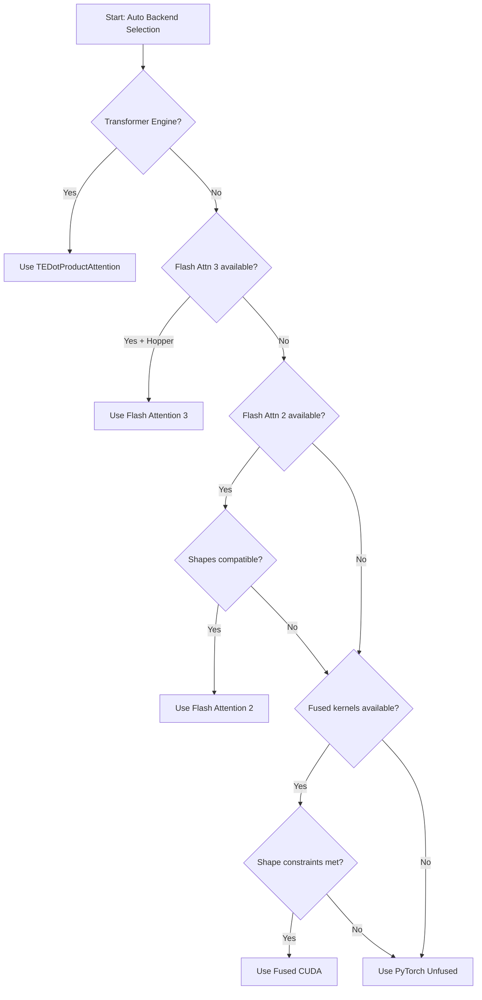

# Kernel Selection Guide

> **How Megatron selects and dispatches optimized kernels at runtime**

---

## Table of Contents

1. [Overview](#overview)
2. [Kernel Selection Philosophy](#kernel-selection-philosophy)
3. [Attention Backend Selection](#attention-backend-selection)
4. [Fused Kernel Availability](#fused-kernel-availability)
5. [JIT Compilation](#jit-compilation)
6. [Configuration Flags Reference](#configuration-flags-reference)
7. [Fallback Mechanisms](#fallback-mechanisms)
8. [Troubleshooting Guide](#troubleshooting-guide)
9. [Best Practices](#best-practices)

---

## Overview

Megatron-LM provides multiple kernel implementations for each operation, automatically selecting the most efficient option based on:

1. **Hardware capabilities** (GPU architecture, CUDA version)
2. **Software availability** (Apex, Transformer Engine, Flash Attention, Triton)
3. **Runtime constraints** (tensor shapes, data types, sequence lengths)
4. **User configuration** (CLI flags, environment variables)

This document explains how kernel selection works, what options are available, and how to troubleshoot when things don't work as expected.

### Key Takeaways

- **Auto-selection works 95% of the time** - Megatron defaults to the best available kernel
- **Manual override available** when you need fine-grained control
- **Graceful fallbacks** ensure code always runs, even with missing dependencies
- **Clear error messages** when mandatory dependencies are missing

---

## Kernel Selection Philosophy

### Hierarchy of Kernel Implementations

Megatron follows a **tiered selection approach**:

```
Tier 1: Specialized fused kernels (Apex, TE, custom CUDA)
  ↓ (fallback if unavailable or incompatible)
Tier 2: Optimized kernels (Flash Attention, Triton)
  ↓ (fallback if unavailable or incompatible)
Tier 3: PyTorch native operations (torch.nn.functional)
```

**Design Principle**: Always try the fastest available implementation, but guarantee correctness with PyTorch fallbacks.

### Why Multiple Implementations?

Different kernels excel in different scenarios:

| Kernel Type | Best For | Example |
|-------------|----------|---------|
| **Custom CUDA** | Critical paths, <200ms latency | Fused softmax+mask |
| **Triton** | Rapid prototyping, good portability | MLA YaRN RoPE |
| **Apex** | Production maturity, wide support | Fused LayerNorm |
| **Transformer Engine** | FP8 training on Hopper | All TE layers |
| **Flash Attention** | Memory-efficient attention | Long sequences |
| **PyTorch native** | Compatibility, correctness | Fallback |

---

## Attention Backend Selection

### AttnBackend Enum

**Location**: `megatron/core/transformer/enums.py:60`

```python
class AttnBackend(enum.Enum):
    """Attention Backend"""
    flash = 1      # Flash Attention (FA2/FA3)
    fused = 2      # Fused CUDA kernels
    unfused = 3    # PyTorch native
    local = 4      # Local attention (for spec layers)
    auto = 5       # Auto-select (default)
```

### CLI Configuration

**Flag**: `--attention-backend`

```bash
# Auto-select best backend (recommended)
--attention-backend auto  # default

# Force Flash Attention
--attention-backend flash

# Force fused CUDA kernels
--attention-backend fused

# Force PyTorch native (for debugging)
--attention-backend unfused

# Use local attention (requires --spec local)
--attention-backend local
```

**Location**: `megatron/training/arguments.py:1562`

```python
group.add_argument(
    '--attention-backend',
    type=lambda attn_backend: AttnBackend[attn_backend],
    default=AttnBackend.auto,
    choices=list(AttnBackend),
    help='Attention backend to use (flash,fused,unfused,local,auto). Defaults to auto'
)
```

### Auto-Selection Logic

When `--attention-backend auto` (default), Megatron selects based on:

#### 1. **Flash Attention Detection**

**Location**: `megatron/core/transformer/attention.py:51-86`

```python
# Try Flash Attention 3 (Hopper-optimized)
try:
    from flash_attn_3.flash_attn_interface import _flash_attn_forward
    from flash_attn_3.flash_attn_interface import flash_attn_with_kvcache as flash_attn3_with_kvcache
    HAVE_FLASH_ATTN_3 = True
except ImportError:
    # Fallback to flashattn_hopper (alternative FA3 package)
    try:
        from flashattn_hopper.flash_attn_interface import _flash_attn_forward
        from flashattn_hopper.flash_attn_interface import flash_attn_with_kvcache as flash_attn3_with_kvcache
        HAVE_FLASH_ATTN_3 = True
    except ImportError:
        HAVE_FLASH_ATTN_3 = False

# Try Flash Attention 2 (general GPU support)
try:
    from flash_attn import flash_attn_varlen_func, flash_attn_with_kvcache
    HAVE_FLASH_ATTN = True
except ImportError:
    flash_attn_varlen_func = None
    flash_attn_with_kvcache = None
    HAVE_FLASH_ATTN = False
```

**Selection priority**:
1. **Flash Attention 3** (if Hopper GPU + `flash_attn_3` or `flashattn_hopper` available)
2. **Flash Attention 2** (if `flash_attn` package available)
3. **Fused CUDA kernels** (fallback)
4. **Unfused PyTorch** (fallback)

#### 2. **Transformer Engine Integration**

When using `--transformer-impl transformer_engine`, attention backend is automatically set to **TE's internal Flash Attention**:

```python
# Transformer Engine uses TEDotProductAttention
# which internally dispatches to:
# - Flash Attention 2 (cuDNN fused attention)
# - cuDNN unfused attention
# - PyTorch native (fallback)
```

**See**: [09-transformer-engine-integration.md](09-transformer-engine-integration.md) for details.

#### 3. **Sequence Length Constraints**

Flash Attention has specific shape requirements. If not met, fallback to fused/unfused:

```python
# Flash Attention constraints (from flash_attn package docs):
# - head_dim ∈ {32, 64, 96, 128, 160, 192, 224, 256}
# - Sequence length must be multiple of 8 (for optimal performance)
# - For causal attention: query_len == key_len
```

### Backend Selection Flowchart



### Inference-Specific Selection

**Flash Decode** for inference decode phase:

**Location**: `megatron/core/transformer/attention.py:478`

```python
assert flash_attn_with_kvcache is not None, (
    "Flash Decoding requires the flash_attn_with_kvcache kernel, "
    "available in the flash-attn package."
)

out = flash_attn_with_kvcache(
    q,  # [total_tokens, num_heads, head_dim]
    k_cache,  # [batch, seqlen_k, num_heads_kv, head_dim]
    v_cache,  # [batch, seqlen_k, num_heads_kv, head_dim]
    cache_seqlens=sequence_len_offset,  # int32 tensor [batch]
    softmax_scale=q_scale_s,
    causal=True,
)
```

**Requirements**:
- `flash_attn` package with KV cache support
- Decode phase (single query token per batch)
- Paged attention compatible

---

## Fused Kernel Availability

### Fused LayerNorm

**Location**: `megatron/core/fusions/fused_layer_norm.py:15-27`

#### Availability Flags

```python
# Persistent LayerNorm (Apex)
try:
    from apex.contrib.layer_norm.layer_norm import FastLayerNormFN
    HAVE_PERSIST_LAYER_NORM = True
except ImportError:
    HAVE_PERSIST_LAYER_NORM = False

# Fused LayerNorm (Apex)
try:
    from apex.normalization.fused_layer_norm import FusedLayerNormAffineFunction
    HAVE_FUSED_LAYER_NORM = True
except ImportError:
    HAVE_FUSED_LAYER_NORM = False
```

#### Selection Logic

**Location**: `megatron/core/fusions/fused_layer_norm.py:100-103`

```python
# Persistent LayerNorm only supports specific hidden sizes
persist_ln_hidden_sizes = [
    1024, 1536, 2048, 2304, 3072, 3840, 4096, 5120,
    6144, 8192, 10240, 12288, 12800, 15360, 16384,
    18432, 20480, 24576, 25600, 30720, 32768, 40960,
    49152, 65536
]

if hidden_size not in persist_ln_hidden_sizes or not HAVE_PERSIST_LAYER_NORM:
    persist_layer_norm = False

if not persist_layer_norm and not HAVE_FUSED_LAYER_NORM:
    # Fallback to torch.nn.LayerNorm
    use_pytorch_native = True
```

#### Runtime Check

```python
def forward(self, input):
    if self.persist_layer_norm:
        # Use Apex persistent kernel (fastest)
        output = FastLayerNormFN.apply(input, self.weight, self.bias, self.eps)
    elif self.fused_layer_norm:
        # Use Apex fused kernel (fast)
        output = FusedLayerNormAffineFunction.apply(input, self.weight, self.bias, self.normalized_shape, self.eps)
    else:
        # Use PyTorch native (slowest, but always available)
        output = torch.nn.functional.layer_norm(input, self.normalized_shape, self.weight, self.bias, self.eps)
    return output
```

### Fused Softmax

**Location**: `megatron/core/fusions/fused_softmax.py`

#### CUDA Kernel Imports

```python
# Import custom CUDA kernels at runtime
import scaled_upper_triang_masked_softmax_cuda  # Causal mask
import scaled_masked_softmax_cuda                # General mask
import scaled_softmax_cuda                       # No mask
```

**These kernels are built during Megatron installation** (see `setup.py`).

#### Shape Constraints

**Location**: `megatron/core/fusions/fused_softmax.py:238-270`

```python
def is_kernel_available(self, mask, b, np, sq, sk):
    """Check whether the fused CUDA kernel can be used.

    Args:
        mask: Attention mask or None
        b: Batch size
        np: Number of attention heads per tensor-parallel partition
        sq: Query sequence length
        sk: Key sequence length

    Returns:
        bool: True if fused kernel can be used
    """
    attn_batches = b * np

    if (
        self.scaled_masked_softmax_fusion  # User wants fusion
        and self.input_in_float16          # Input must be FP16
        and 16 < sk <= 4096                # Key length: 16 < sk <= 4096
        and sq % 4 == 0                    # Query length divisible by 4
        and sk % 4 == 0                    # Key length divisible by 4
        and attn_batches % 4 == 0          # Batch * heads divisible by 4
    ):
        if 0 <= sk <= 4096:
            batch_per_block = self.get_batch_per_block(sq, sk, b, np)

            if self.attn_mask_type == AttnMaskType.causal:
                if attn_batches % batch_per_block == 0:
                    return True
            else:
                if sq % batch_per_block == 0:
                    return True
    return False
```

**Key Constraints**:
1. **Data type**: Input must be FP16 or BF16 (not FP32)
2. **Sequence length**: 16 < sk ≤ 4096
3. **Alignment**: sq, sk, (b * np) must be divisible by 4
4. **Batch distribution**: Specific batch_per_block constraints

#### Fallback to PyTorch

**Location**: `megatron/core/fusions/fused_softmax.py:233-236`

```python
def forward(self, input: torch.Tensor, mask: Optional[torch.Tensor], softmax_offset: Optional[torch.Tensor] = None):
    if self.is_kernel_available(mask, *input.size()) and softmax_offset is None:
        return self.forward_fused_softmax(input, mask)  # CUDA kernel
    else:
        return self.forward_torch_softmax(input, mask, softmax_offset)  # PyTorch fallback
```

### Fused Cross-Entropy

**Location**: `megatron/core/fusions/fused_cross_entropy.py`

#### Availability

Depends on custom CUDA kernel `fused_vocab_parallel_cross_entropy_cuda`:

```python
import fused_vocab_parallel_cross_entropy_cuda

# Built during setup (setup.py)
```

#### When It's Used

**Only for vocabulary-parallel models**:

```python
if config.tensor_model_parallel_size > 1 and config.parallel_vocab:
    # Use fused cross-entropy (vocab is sharded across TP)
    loss = fused_vocab_parallel_cross_entropy_cuda.forward(logits, targets)
else:
    # Use PyTorch native
    loss = torch.nn.functional.cross_entropy(logits, targets)
```

**Performance gain**: 10-30% for large vocabulary (32K+ tokens) with TP.

### Triton-based Kernels

**Location**: `megatron/core/fusions/fused_mla_yarn_rope_apply.py`, `fused_indices_converter.py`, `fused_pad_routing_map.py`

#### Availability Check

```python
try:
    import triton
    import triton.language as tl
    from packaging import version
    if version.parse(triton.__version__) >= version.parse("2.0.0"):
        HAVE_TRITON = True
    else:
        HAVE_TRITON = False
except ImportError:
    HAVE_TRITON = False

if not HAVE_TRITON:
    raise ImportError("Triton >= 2.0.0 is required for MoE/MLA fusions")
```

**Affected kernels**:
- **MLA YaRN RoPE fusion** (DeepSeek-V3): `fused_mla_yarn_rope_apply`
- **MoE token routing map**: `fused_indices_converter`
- **MoE padding**: `fused_pad_routing_map`

**Fallback**: No PyTorch fallback - raises error if Triton unavailable.

---

## JIT Compilation

### jit_fuser Decorator

**Location**: `megatron/core/jit.py`

Megatron uses a **version-adaptive JIT strategy**:

```python
import torch
from megatron.core.utils import is_torch_min_version

jit_fuser = torch.jit.script  # Default: TorchScript

# PyTorch ≥ 2.2: Use torch.compile (nvFuser deprecated)
try:
    if is_torch_min_version("2.2.0a0"):
        jit_fuser = torch.compile
except ImportError:
    # If version check fails, use noop
    def noop_decorator(func):
        return func
    jit_fuser = noop_decorator
```

### Where It's Used

Search results from codebase:

```
megatron/core/transformer/utils.py
megatron/core/transformer/torch_norm.py
megatron/core/transformer/moe/experts.py
megatron/core/fusions/fused_weighted_squared_relu.py
megatron/core/fusions/fused_cross_entropy.py
megatron/core/fusions/fused_bias_swiglu.py
megatron/core/fusions/fused_bias_gelu.py
megatron/core/fusions/fused_bias_geglu.py
megatron/core/fusions/fused_bias_dropout.py
megatron/core/activations.py
```

### Example: Fused Bias + SwiGLU

**Location**: `megatron/core/fusions/fused_bias_swiglu.py`

```python
from megatron.core.jit import jit_fuser

@jit_fuser
def swiglu_forward(input, bias):
    """Fused bias addition + SwiGLU activation.

    SwiGLU(x) = x * sigmoid(gate) where gate = linear(x) + bias
    """
    input_with_bias = input + bias if bias is not None else input
    gate, activation = torch.chunk(input_with_bias, 2, dim=-1)
    return activation * torch.nn.functional.silu(gate)
```

**Effect**:
- **PyTorch < 2.2**: Compiled to TorchScript graph (moderate speedup)
- **PyTorch ≥ 2.2**: Compiled with `torch.compile` (better speedup, ~10-20%)
- **ImportError**: Runs as regular Python (no speedup)

### Disabling JIT

**Environment variable**:

```bash
# Disable torch.compile (useful for debugging)
export TORCH_COMPILE_DISABLE=1

# Disable TorchScript
export PYTORCH_JIT=0
```

**Effect**: All `@jit_fuser` decorators become no-ops.

---

## Configuration Flags Reference

### Attention-Related Flags

| Flag | Values | Default | Description |
|------|--------|---------|-------------|
| `--attention-backend` | flash, fused, unfused, local, auto | auto | Attention kernel backend |
| `--use-flash-attn` | flag | False | Force Flash Attention (deprecated, use `--attention-backend flash`) |
| `--use-mcore-path` | flag | False | Use Megatron Core attention (recommended) |
| `--attn-softmax-in-fp32` | flag | True | Compute softmax in FP32 (better numerical stability) |
| `--sliding-window-size` | int | None | Sliding window attention size |
| `--num-query-groups` | int | None | For GQA/MQA (grouped-query attention) |

### Fusion-Related Flags

| Flag | Values | Default | Description |
|------|--------|---------|-------------|
| `--bias-gelu-fusion` | flag | False | Fuse bias addition + GELU |
| `--bias-swiglu-fusion` | flag | False | Fuse bias addition + SwiGLU |
| `--bias-dropout-fusion` | flag | False | Fuse bias + dropout + residual add |
| `--masked-softmax-fusion` | flag | False | Fuse scale + mask + softmax |
| `--persist-layer-norm` | flag | False | Use persistent fused LayerNorm |
| `--zero-centered-gamma` | flag | False | Zero-centered LayerNorm weights |

**Location**: `megatron/training/arguments.py` (various line numbers)

### Transformer Engine Flags

| Flag | Values | Default | Description |
|------|--------|---------|-------------|
| `--transformer-impl` | local, transformer_engine | local | Use Transformer Engine layers |
| `--fp8-format` | e4m3, hybrid | hybrid | FP8 format for TE |
| `--fp8-amax-history-len` | int | 1024 | AMAX history for FP8 scaling |
| `--fp8-amax-compute-algo` | max, most_recent | most_recent | AMAX computation method |
| `--fp8-recipe` | DelayedScaling, Tensorwise, MXFP8, Blockwise, custom | DelayedScaling | FP8 quantization recipe |

**See**: [12-te-configuration-reference.md](12-te-configuration-reference.md) for full TE flags.

### MoE-Specific Flags

| Flag | Values | Default | Description |
|------|--------|---------|-------------|
| `--moe-grouped-gemm` | flag | False | Use grouped GEMM for MoE experts |
| `--moe-token-dispatcher-type` | allgather, alltoall | alltoall | Token routing communication pattern |
| `--num-experts` | int | None | Number of MoE experts |
| `--expert-model-parallel-size` | int | 1 | Expert parallelism degree |

### Distributed Backend Flags

| Flag | Values | Default | Description |
|------|--------|---------|-------------|
| `--distributed-backend` | nccl, mpi, gloo | nccl | PyTorch distributed backend |
| `--tp-comm-bootstrap-backend` | nccl, ucc | nccl | Tensor parallel communication backend |
| `--pipeline-model-parallel-comm-backend` | nccl, ucc | None | Pipeline parallel backend |
| `--nccl-ub` | flag | False | Use NCCL userbuffers (requires TE ≥ 2.9) |

### CUDA Optimization Flags

| Flag | Values | Default | Description |
|------|--------|---------|-------------|
| `--bf16-enable-reduced-precision-reduction` | flag | True | Allow BF16 reduced-precision matmul reductions |
| `--use-flash-attn-triton` | flag | False | Use Triton-based Flash Attention |

**Location**: `megatron/training/arguments.py:2559`

---

## Fallback Mechanisms

### Fallback Hierarchy

Megatron implements **graceful degradation** for kernel selection:

```
Level 1: Hardware-accelerated fused kernels (Apex CUDA, custom CUDA)
  ↓ (missing dependency or incompatible shapes)
Level 2: Portable fused kernels (Triton, torch.compile)
  ↓ (missing dependency or unsupported operation)
Level 3: PyTorch native operations (torch.nn.functional)
  ↓ (if even PyTorch fails)
Level 4: Raise error with diagnostic message
```

### Automatic Fallback Examples

#### 1. LayerNorm Fallback

```python
# Priority 1: Apex Persistent LayerNorm (fastest, limited hidden sizes)
if hidden_size in [1024, 2048, ...] and HAVE_PERSIST_LAYER_NORM:
    use_persistent = True

# Priority 2: Apex Fused LayerNorm (fast, any hidden size)
elif HAVE_FUSED_LAYER_NORM:
    use_fused = True

# Priority 3: PyTorch native (slowest, always available)
else:
    use_pytorch = True
```

#### 2. Softmax Fallback

```python
def forward(self, input, mask):
    # Try fused CUDA kernel
    if self.is_kernel_available(mask, *input.size()):
        return self.forward_fused_softmax(input, mask)

    # Fallback to PyTorch
    else:
        return self.forward_torch_softmax(input, mask)
```

#### 3. Attention Fallback

```python
# Priority 1: Flash Attention 3 (Hopper only)
if HAVE_FLASH_ATTN_3 and is_hopper_gpu():
    attn_output = flash_attn3_with_kvcache(...)

# Priority 2: Flash Attention 2 (Ampere+)
elif HAVE_FLASH_ATTN:
    attn_output = flash_attn_varlen_func(...)

# Priority 3: Fused CUDA kernels
elif fused_kernels_available():
    attn_output = fused_attention(...)

# Priority 4: PyTorch native
else:
    attn_output = torch.nn.functional.scaled_dot_product_attention(...)
```

### No-Fallback Scenarios

Some kernels **require** specific dependencies and will error if unavailable:

#### 1. MoE Triton Kernels

```python
if not HAVE_TRITON:
    raise ImportError(
        "Triton >= 2.0.0 is required for MoE token routing optimizations. "
        "Install with: pip install triton"
    )
```

**Reason**: MoE routing logic is complex and no equivalent PyTorch implementation exists.

#### 2. Flash Decode

```python
assert flash_attn_with_kvcache is not None, (
    "Flash Decoding requires the flash_attn_with_kvcache kernel, "
    "available in the flash-attn package."
)
```

**Reason**: Inference decode optimization is critical; fallback would be too slow.

#### 3. Transformer Engine FP8

```python
if config.fp8 and not transformer_engine_available:
    raise ImportError(
        "FP8 training requires Transformer Engine. "
        "Install with: pip install transformer-engine[pytorch]"
    )
```

**Reason**: FP8 is hardware-specific (Hopper+); no software fallback.

---

## Troubleshooting Guide

### Common Issues

#### 1. "ImportError: No module named 'apex'"

**Symptom**:
```
ImportError: cannot import name 'FastLayerNormFN' from 'apex.contrib.layer_norm.layer_norm'
```

**Cause**: Apex not installed or incorrectly installed.

**Solution**:
```bash
# Install Apex from source
git clone https://github.com/NVIDIA/apex
cd apex
pip install -v --disable-pip-version-check --no-cache-dir --no-build-isolation \
    --config-settings "--build-option=--cpp_ext" --config-settings "--build-option=--cuda_ext" ./
```

**Workaround**: Disable fused kernels that require Apex:
```bash
--no-bias-gelu-fusion \
--no-bias-dropout-fusion \
--no-persist-layer-norm
```

---

#### 2. "ImportError: No module named 'flash_attn'"

**Symptom**:
```
ModuleNotFoundError: No module named 'flash_attn'
```

**Cause**: Flash Attention not installed.

**Solution**:
```bash
# Install Flash Attention 2
pip install flash-attn --no-build-isolation

# Or install Flash Attention 3 (Hopper only)
pip install flash-attn-3 --no-build-isolation
```

**Workaround**: Use fused or unfused backend:
```bash
--attention-backend fused  # or unfused
```

---

#### 3. "RuntimeError: fused kernel constraints not met"

**Symptom**:
```
Softmax fusion disabled due to shape constraints: sq=1023 (not divisible by 4)
```

**Cause**: Sequence length not compatible with fused kernel requirements.

**Solution**: Adjust sequence length to meet constraints:
```bash
# Make sure seq_length is divisible by 4
--seq-length 1024  # instead of 1023
```

**Workaround**: Disable fusion (uses PyTorch fallback):
```bash
--no-masked-softmax-fusion
```

---

#### 4. "Triton version mismatch"

**Symptom**:
```
ImportError: Triton >= 2.0.0 is required, found 1.9.0
```

**Cause**: Old Triton version installed.

**Solution**:
```bash
pip install --upgrade triton>=2.0.0
```

**Workaround**: Avoid MoE models or MLA attention:
```bash
# Don't use DeepSeek-V3 or other MLA models
```

---

#### 5. "Flash Attention 3 not found on Hopper"

**Symptom**:
```
Warning: Flash Attention 3 not found, falling back to Flash Attention 2
```

**Cause**: `flash-attn-3` package not installed on H100/H200.

**Solution**:
```bash
# Install Flash Attention 3 (Hopper-optimized)
pip install flash-attn-3 --no-build-isolation

# Or alternative Hopper package
pip install flashattn-hopper --no-build-isolation
```

**Impact**: ~10-20% slower attention on Hopper without FA3.

---

#### 6. "CUDA kernel launch failed"

**Symptom**:
```
RuntimeError: CUDA error: invalid configuration argument
CUDA kernel errors might be asynchronously reported at some other API call
```

**Possible Causes**:
1. **Sequence length too large**: Exceeds CUDA kernel limits (>4096)
2. **Batch size too large**: Exceeds shared memory
3. **Hidden size unsupported**: Fused kernel doesn't support this size

**Solution**:
```bash
# 1. Reduce sequence length
--seq-length 2048  # instead of 8192

# 2. Use Flash Attention (supports longer sequences)
--attention-backend flash

# 3. Disable problematic fusion
--no-masked-softmax-fusion
```

**Debug**: Enable CUDA launch blocking to get exact error location:
```bash
export CUDA_LAUNCH_BLOCKING=1
python pretrain_gpt.py ...
```

---

#### 7. "Persistent LayerNorm not available for hidden_size=XXX"

**Symptom**:
```
Warning: Persistent LayerNorm not available for hidden_size=2560, using fused LayerNorm
```

**Cause**: Persistent LayerNorm only supports specific hidden sizes:
```python
persist_ln_hidden_sizes = [
    1024, 1536, 2048, 2304, 3072, 3840, 4096, 5120,
    6144, 8192, 10240, 12288, 12800, 15360, 16384,
    18432, 20480, 24576, 25600, 30720, 32768, 40960,
    49152, 65536
]
```

**Solution**: Choose supported hidden size:
```bash
--hidden-size 2048  # instead of 2560
```

**Workaround**: Use regular fused LayerNorm (only ~5% slower):
```bash
--no-persist-layer-norm  # explicitly disable
```

---

### Diagnostic Commands

#### Check Installed Packages

```bash
# Check Apex
python -c "import apex; print(apex.__version__)"

# Check Flash Attention
python -c "import flash_attn; print(flash_attn.__version__)"

# Check Transformer Engine
python -c "import transformer_engine; print(transformer_engine.__version__)"

# Check Triton
python -c "import triton; print(triton.__version__)"
```

#### Verify CUDA Kernels Built

```bash
# Check if Megatron CUDA extensions are available
python -c "import scaled_upper_triang_masked_softmax_cuda; print('✓ Fused softmax available')"
python -c "import fused_vocab_parallel_cross_entropy_cuda; print('✓ Fused cross-entropy available')"
```

If import fails, rebuild Megatron:
```bash
cd Megatron-LM
pip install --no-build-isolation -e .
```

#### Test Attention Backend

```bash
# Test if Flash Attention works
python -c "
from megatron.core.transformer.attention import CoreAttention
from megatron.core.transformer import TransformerConfig

config = TransformerConfig(
    num_layers=1,
    hidden_size=1024,
    num_attention_heads=16,
    attention_backend='flash',  # Test Flash
)
print('✓ Flash Attention backend works')
"
```

---

### Performance Verification

#### Verify Kernel Selection

Add logging to see which kernels are used:

```python
# In your training script
import logging
logging.basicConfig(level=logging.INFO)

# Megatron will print kernel selection info:
# INFO: Using Flash Attention 2 for attention
# INFO: Using persistent LayerNorm for hidden_size=4096
# INFO: Using fused SwiGLU activation
```

#### Benchmark Different Backends

```bash
# Benchmark Flash vs Fused attention
for backend in flash fused unfused; do
    echo "Testing backend: $backend"
    torchrun --nproc_per_node=8 pretrain_gpt.py \
        --attention-backend $backend \
        --max-position-embeddings 2048 \
        --seq-length 2048 \
        ...
done
```

Expected performance (relative to unfused):
- **Flash**: 2-4× faster
- **Fused**: 1.5-2× faster
- **Unfused**: 1× (baseline)

---

## Best Practices

### 1. Use Auto-Selection by Default

**Recommended**:
```bash
--attention-backend auto  # Let Megatron choose
```

**Manual override only when**:
- Debugging (use `unfused` for correctness)
- Benchmarking (test each backend)
- Known optimal backend for your model

---

### 2. Enable Recommended Fusions

**For GPT/LLaMA models**:
```bash
--bias-swiglu-fusion  # Fuse bias + SwiGLU (5-15% speedup)
--masked-softmax-fusion  # Fuse scale + mask + softmax (10-20% speedup)
--persist-layer-norm  # Use persistent LayerNorm if hidden_size supported
--zero-centered-gamma  # Improve numerical stability
```

**For T5 models**:
```bash
--bias-gelu-fusion  # T5 uses GELU
--masked-softmax-fusion
--persist-layer-norm
```

**For MoE models**:
```bash
--moe-grouped-gemm  # 3-5× faster expert computation
--bias-swiglu-fusion  # (if using SwiGLU experts)
```

---

### 3. Verify Dependencies Before Training

**Check script**:
```bash
#!/bin/bash
# check_dependencies.sh

echo "Checking Megatron dependencies..."

# Required
python -c "import torch; print('✓ PyTorch:', torch.__version__)"
python -c "import numpy; print('✓ NumPy:', numpy.__version__)"

# Recommended
python -c "import apex; print('✓ Apex:', apex.__version__)" 2>/dev/null || echo "✗ Apex not found"
python -c "import flash_attn; print('✓ Flash Attention:', flash_attn.__version__)" 2>/dev/null || echo "✗ Flash Attention not found"
python -c "import transformer_engine; print('✓ Transformer Engine:', transformer_engine.__version__)" 2>/dev/null || echo "✗ Transformer Engine not found"
python -c "import triton; print('✓ Triton:', triton.__version__)" 2>/dev/null || echo "✗ Triton not found"

echo "Checking CUDA kernels..."
python -c "import scaled_upper_triang_masked_softmax_cuda; print('✓ Fused softmax')" 2>/dev/null || echo "✗ Fused softmax not built"
python -c "import fused_vocab_parallel_cross_entropy_cuda; print('✓ Fused cross-entropy')" 2>/dev/null || echo "✗ Fused cross-entropy not built"

echo "Done!"
```

---

### 4. Match Hardware to Kernel

| GPU Architecture | Recommended Backend | Avoid |
|------------------|---------------------|-------|
| **Hopper (H100/H200)** | Flash Attention 3 + TE FP8 | Unfused |
| **Ampere (A100)** | Flash Attention 2 + TE | Unfused |
| **Volta (V100)** | Fused CUDA | Flash (not supported) |
| **Turing/Pascal** | Fused CUDA | Flash, TE FP8 |

---

### 5. Sequence Length Optimization

| Sequence Length | Recommended Backend | Notes |
|-----------------|---------------------|-------|
| < 512 | Fused CUDA | Overhead of Flash Attention not worth it |
| 512 - 8K | Flash Attention 2 | Sweet spot for FA2 |
| 8K - 32K | Flash Attention 2 + CP | Use Context Parallelism |
| > 32K | Flash Attention + CP + SP | Sequence + Context Parallelism |

---

### 6. Debug with Unfused Backend

When debugging numerical issues:
```bash
--attention-backend unfused \
--no-bias-swiglu-fusion \
--no-masked-softmax-fusion \
--attn-softmax-in-fp32
```

This uses PyTorch native ops (slowest but most numerically stable).

---

### 7. Production Training Checklist

Before starting multi-day training:

- [ ] Flash Attention installed (`flash-attn` or `flash-attn-3`)
- [ ] Transformer Engine installed (if using FP8)
- [ ] Apex installed (for fused LayerNorm)
- [ ] Triton ≥ 2.0.0 (if using MoE or MLA)
- [ ] CUDA kernels built (`python -c "import scaled_upper_triang_masked_softmax_cuda"`)
- [ ] Tested on 1 GPU (verify no import errors)
- [ ] Tested on 8 GPUs (verify distributed works)
- [ ] Verified hidden_size compatible with persistent LayerNorm (or disabled)
- [ ] Verified sequence length meets fusion constraints (divisible by 4)

---

## Summary

### Key Takeaways

1. **Auto-selection works** - Default `--attention-backend auto` chooses the best available backend
2. **Graceful fallbacks** - Missing dependencies → automatic fallback to PyTorch
3. **Shape constraints matter** - Fused kernels have specific shape requirements
4. **Hardware-specific optimizations** - Flash Attention 3 on Hopper, TE FP8 on Hopper/Ada
5. **Verify before training** - Check dependencies to avoid mid-training failures

### Kernel Selection Quick Reference

| Operation | Best Kernel | Fallback |
|-----------|-------------|----------|
| **Attention** | Flash Attention 2/3 | Fused CUDA → Unfused |
| **LayerNorm** | Apex Persistent | Apex Fused → PyTorch |
| **Softmax** | Fused CUDA | PyTorch |
| **SwiGLU** | Fused (JIT compiled) | PyTorch |
| **Cross-Entropy** | Fused (vocab-parallel) | PyTorch |
| **MoE Routing** | Triton kernels | No fallback (error) |

### Configuration Templates

**High Performance (H100 GPUs)**:
```bash
--attention-backend auto \
--transformer-impl transformer_engine \
--fp8-format hybrid \
--bias-swiglu-fusion \
--masked-softmax-fusion \
--persist-layer-norm \
--zero-centered-gamma \
--use-mcore-path
```

**Compatibility (V100/T4 GPUs)**:
```bash
--attention-backend fused \  # No Flash Attention on Volta
--bias-swiglu-fusion \
--masked-softmax-fusion \
--use-mcore-path
```

**Debugging**:
```bash
--attention-backend unfused \
--no-bias-swiglu-fusion \
--no-masked-softmax-fusion \
--attn-softmax-in-fp32 \
--use-mcore-path
```

---

## Related Documents

- **[04-activation-fusions.md](04-activation-fusions.md)**: Deep dive into SwiGLU, GELU, GeGLU fusions
- **[05-attention-kernels.md](05-attention-kernels.md)**: Softmax and cross-entropy fusion details
- **[06-normalization-fusions.md](06-normalization-fusions.md)**: LayerNorm variants and bias-dropout-add
- **[09-transformer-engine-integration.md](09-transformer-engine-integration.md)**: TE backend selection
- **[16-flash-attention-optimizations.md](16-flash-attention-optimizations.md)**: Flash Attention variants and RoPE fusion

---

**Document Version**: 1.0
**Last Updated**: 2025-12-07
**Estimated Reading Time**: 30 minutes
**Target Audience**: All Megatron users
