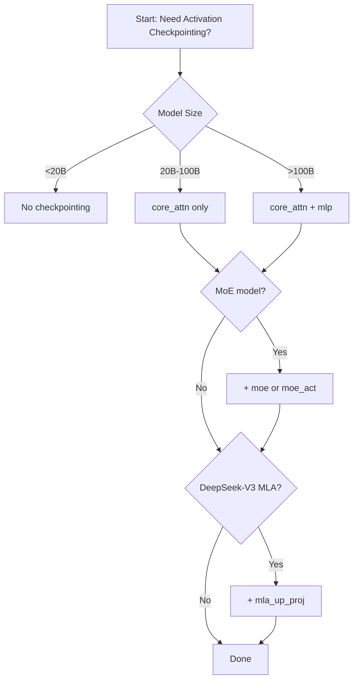

# Activation Checkpointing

> **Memory-efficient training through selective activation recomputation**

---

## Table of Contents

1. [Overview](#overview)
2. [Why Activation Checkpointing](#why-activation-checkpointing)
3. [Granularity Options](#granularity-options)
4. [Recompute Methods](#recompute-methods)
5. [Selective Module Guide](#selective-module-guide)
6. [Memory vs Compute Trade-offs](#memory-vs-compute-trade-offs)
7. [Configuration Examples](#configuration-examples)
8. [FP8 Compatibility](#fp8-compatibility)
9. [Implementation Details](#implementation-details)
10. [Troubleshooting](#troubleshooting)
11. [Best Practices](#best-practices)

---

## Overview

**Activation checkpointing** (also called **activation recomputation** or **gradient checkpointing**) is a technique to reduce memory usage during training by **not storing** intermediate activations during the forward pass. Instead, these activations are **recomputed** during the backward pass when needed for gradient calculation.

### Key Concept

```
Standard Training (No Checkpointing):
Forward:  Store ALL activations
Backward: Use stored activations to compute gradients
Memory:   HIGH (stores all intermediate activations)
Compute:  1× (no recomputation)

With Activation Checkpointing:
Forward:  Store SELECTED activations only
Backward: Recompute missing activations, then compute gradients
Memory:   LOW (3-5× reduction)
Compute:  1.2-1.3× (20-30% overhead from recomputation)
```

### Quick Start

**Recommended for most users** (20B+ parameter models):
```bash
python pretrain_gpt.py \
    --recompute-activations \  # Enable selective checkpointing with default modules
    ...
```

**Or with explicit control**:
```bash
python pretrain_gpt.py \
    --recompute-granularity selective \
    --recompute-modules core_attn \
    ...
```

---

## Why Activation Checkpointing

### Memory Bottleneck in Large Models

For a transformer layer with:
- Batch size `b`
- Sequence length `s`
- Hidden dimension `h`
- Number of attention heads `a`

**Activation memory** (approximate):

| Component | Memory per Layer | Notes |
|-----------|------------------|-------|
| **QKV projections** | `3 × b × s × h` | Query, Key, Value tensors |
| **Attention scores** | `b × a × s × s` | **MOST MEMORY INTENSIVE** |
| **Attention output** | `b × s × h` | After attention |
| **MLP intermediate** | `b × s × 4h` | FFN hidden dimension |
| **Residuals, LayerNorm** | `~2 × b × s × h` | Residual connections |

**Total per layer**: `~(9 + 4a/h) × b × s × h` bytes (in FP16/BF16)

For **GPT-3 175B** (96 layers, h=12288, a=96, s=2048, b=1):
- **Per-layer activation memory**: ~9 GB
- **Total (96 layers)**: ~850 GB
- **With gradient storage**: ~1.7 TB

**Memory Breakdown**:
- **Model parameters**: 350 GB (175B × 2 bytes)
- **Optimizer state**: 700 GB (Adam: 2× parameters)
- **Activations**: **1.7 TB** ← **Bottleneck!**
- **Gradients**: 350 GB

**Solution**: Use activation checkpointing to reduce activation memory from 1.7 TB → ~350 GB (5× reduction).

---

### When to Use Activation Checkpointing

**Always use for**:
- Models ≥ 20B parameters
- Long sequences (8K+ tokens)
- Large batch sizes
- Limited GPU memory

**Trade-off**:
- ✅ **Memory**: 3-5× reduction in activation memory
- ❌ **Compute**: 20-30% slower training (extra forward passes during backward)

**Net effect**: Usually **positive** because:
1. Larger batch sizes → better GPU utilization → faster training
2. Enables training models that otherwise wouldn't fit in memory

---

## Granularity Options

Megatron supports two granularity levels:

### 1. Selective Checkpointing (Recommended)

**Flag**: `--recompute-granularity selective`

**Behavior**: Checkpoint **specific submodules** within each transformer layer.

**Default**: Checkpoints `core_attn` (attention matrix computation).

```bash
--recompute-granularity selective \
--recompute-modules core_attn  # Default
```

**Why selective?**
- **Attention is memory-intensive**: O(s²) memory for attention scores
- **But compute-light**: Simple matmul operations
- **Optimal for LLMs**: Saves most memory with least recomputation overhead

**Memory savings**: 3-5× reduction (saves attention scores, which dominate memory)

**Compute overhead**: 20-30% (recomputing attention is cheap)

**Location**: `megatron/core/transformer/transformer_config.py:298-307`

```python
recompute_granularity: Optional[str] = None
"""Determines which type of activation recompute to use. Megatron-core supports 'selective'
activation checkpointing where the submodules set in --recompute-modules is checkpointed.
The default is "core_attn" which is the memory intensive part of attention.
These memory intensive activations are also less compute intensive which makes activation
checkpointing more efficient for LLMs (20B+). See Reducing Activation Recomputation in Large
Transformer Models (https://arxiv.org/abs/2205.05198) for more details."""
```

---

### 2. Full Checkpointing

**Flag**: `--recompute-granularity full`

**Behavior**: Checkpoint the **entire transformer layer** (all activations).

```bash
--recompute-granularity full \
--recompute-method uniform \
--recompute-num-layers 1
```

**Why full?**
- **Maximum memory savings**: Saves ALL intermediate activations
- **Higher compute cost**: Must recompute entire layer during backward

**Memory savings**: 5-10× reduction (saves everything)

**Compute overhead**: 30-50% (recomputing entire layer is expensive)

**When to use**:
- Extreme memory constraints (can't fit model otherwise)
- Willing to trade compute for memory
- Debugging (simplifies activation flow)

---

### 3. No Checkpointing

**Flag**: `--recompute-granularity None` (or omit)

**Behavior**: Store ALL activations (no recomputation).

**Memory savings**: None

**Compute overhead**: None (fastest)

**When to use**:
- Small models (<10B parameters)
- Abundant GPU memory
- Need maximum training speed

---

## Recompute Methods

When using checkpointing, you can control **which layers** are checkpointed:

### 1. All Layers (Default)

**Flag**: `--recompute-method None` (or omit)

**Behavior**: Apply checkpointing to **all transformer layers**.

```bash
--recompute-granularity selective
# --recompute-method None  (implicit)
```

**Use**: Default, most common.

---

### 2. Uniform Method

**Flag**: `--recompute-method uniform`

**Behavior**: Divide layers into **uniform chunks** and checkpoint each chunk.

```bash
--recompute-granularity full \
--recompute-method uniform \
--recompute-num-layers 4  # Checkpoint every 4 layers
```

**Example** (32 layers, `recompute_num_layers=4`):
- Layers 0-3: Checkpoint layer 0
- Layers 4-7: Checkpoint layer 4
- Layers 8-11: Checkpoint layer 8
- ...
- Layers 28-31: Checkpoint layer 28

**Total checkpoints**: 32 / 4 = 8 layers checkpointed

**Memory savings**: ~75% of activation memory (only checkpoint 1 out of 4 layers)

**Compute overhead**: Reduced (less recomputation)

**Location**: `megatron/core/transformer/transformer_config.py:310-311`

```python
recompute_method: Optional[str] = None
"""uniform will uniformly divide the total number of transformer layers in a transformer block
and recompute the input activation of each divided chunk at the specified granularity."""
```

---

### 3. Block Method

**Flag**: `--recompute-method block`

**Behavior**: Checkpoint **first N layers** in each pipeline stage.

```bash
--recompute-granularity full \
--recompute-method block \
--recompute-num-layers 8  # Checkpoint first 8 layers per PP stage
```

**Example** (32 layers, 4 PP stages, `recompute_num_layers=8`):
- PP stage 0 (layers 0-7): Checkpoint layers 0-7
- PP stage 1 (layers 8-15): Checkpoint layers 8-15
- PP stage 2 (layers 16-23): Checkpoint layers 16-23
- PP stage 3 (layers 24-31): Checkpoint layers 24-31

**Memory savings**: Balances memory across PP stages

**Use**: Pipeline parallelism with memory imbalance (early stages have more memory)

**Location**: `megatron/core/transformer/transformer_config.py:312-315`

```python
"""block will recompute the input activations for only a set number of transformer layers per
pipeline stage. The rest of the layers in the pipeline stage will not have any activations
recomputed."""
```

---

### Summary Table

| Method | Layers Checkpointed | Memory Savings | Compute Overhead | Use Case |
|--------|---------------------|----------------|------------------|----------|
| **None (all layers)** | All layers | Maximum | Highest | Default (20B+ models) |
| **Uniform** | Every Nth layer | Moderate | Moderate | Memory-constrained, want speed |
| **Block** | First N per PP stage | Balanced across PP | Moderate | Pipeline parallelism |

---

## Selective Module Guide

When using `--recompute-granularity selective`, you can specify **which submodules** to checkpoint:

### Available Modules

**Location**: `megatron/core/transformer/transformer_config.py:326-339`

```python
recompute_modules: Optional[List[str]] = None
"""The submodules to recompute.
choices: "core_attn", "moe_act", "layernorm", "mla_up_proj", "mlp", "moe", "shared_experts".
default: ["core_attn"].
"""
```

---

### 1. `core_attn` (Default, Recommended)

**What it checkpoints**: Core attention computation (attention scores + softmax).

**Memory saved**: O(s²) attention scores (largest activation)

**Compute overhead**: Low (~20%)

```bash
--recompute-granularity selective \
--recompute-modules core_attn
```

**Why default?**
- **Attention scores** are the most memory-intensive activations (O(s²))
- But **computationally cheap** to recompute (just matmul + softmax)
- **Best memory/compute trade-off** for LLMs

**Use for**: All models ≥ 20B parameters

**Implementation**: `megatron/core/transformer/attention.py:197-268`

```python
self.checkpoint_core_attention = (
    self.config.recompute_granularity == 'selective'
    and "core_attn" in self.config.recompute_modules
)

if self.checkpoint_core_attention and self.training:
    core_attn_out = self._checkpointed_attention_forward(...)
```

---

### 2. `mlp`

**What it checkpoints**: Dense MLP (FFN) submodule.

**Memory saved**: MLP intermediate activations (`b × s × 4h`)

**Compute overhead**: Moderate (~10-15%)

```bash
--recompute-granularity selective \
--recompute-modules mlp
```

**Use for**:
- Models with very large FFN hidden dimension (e.g., 16× or 32× hidden size)
- When MLP dominates memory (rare)

**Trade-off**: MLP is more compute-intensive than attention, so recomputation is more expensive.

---

### 3. `moe`

**What it checkpoints**: Entire MoE layer (router + experts).

**Memory saved**: MoE expert activations (large for MoE models)

**Compute overhead**: High (~30-40%)

```bash
--recompute-granularity selective \
--recompute-modules moe
```

**Use for**: Mixture-of-Experts models (Mixtral, DeepSeek-V3) with memory constraints.

---

### 4. `moe_act`

**What it checkpoints**: MoE MLP activation function (e.g., SwiGLU).

**Memory saved**: Activation function output (moderate)

**Compute overhead**: Low (~5-10%)

**Checkpointing type**: Output-discarding (special optimization).

```bash
--recompute-granularity selective \
--recompute-modules moe_act
```

**Use for**: MoE models where activation functions dominate memory.

---

### 5. `shared_experts`

**What it checkpoints**: Shared experts in MoE layer (DeepSeek-V3).

**Memory saved**: Shared expert activations

**Compute overhead**: Moderate

```bash
--recompute-granularity selective \
--recompute-modules shared_experts
```

**Use for**: DeepSeek-V3 and other models with shared experts.

---

### 6. `layernorm`

**What it checkpoints**: Input LayerNorm and pre-MLP LayerNorm.

**Memory saved**: Small (LayerNorm outputs are small)

**Compute overhead**: Very low (~2-5%)

**Checkpointing type**: Output-discarding.

```bash
--recompute-granularity selective \
--recompute-modules layernorm
```

**Use for**: Rarely needed (LayerNorm memory is negligible).

---

### 7. `mla_up_proj`

**What it checkpoints**: MLA (Multi-Latent Attention) up projection + RoPE application.

**Memory saved**: MLA intermediate activations (significant for DeepSeek-V3)

**Compute overhead**: Moderate

**Checkpointing type**: Output-discarding.

```bash
--recompute-granularity selective \
--recompute-modules mla_up_proj
```

**Use for**: DeepSeek-V3 with MLA attention.

---

### Multiple Modules

**You can checkpoint multiple modules**:

```bash
--recompute-granularity selective \
--recompute-modules core_attn mlp
```

**Effect**: Checkpoints both attention and MLP → more memory savings, more compute overhead.

---

### Module Selection Decision Tree



---

## Memory vs Compute Trade-offs

### Quantitative Analysis

#### Memory Savings

For a **GPT-3 70B** model (80 layers, h=8192, s=2048, b=8):

| Configuration | Activation Memory | Savings |
|---------------|-------------------|---------|
| **No checkpointing** | 1.2 TB | 0% |
| **Selective (core_attn)** | 350 GB | **71%** |
| **Selective (core_attn + mlp)** | 200 GB | **83%** |
| **Full checkpointing** | 150 GB | **87%** |

**Key insight**: Selective `core_attn` gives 70%+ memory savings with minimal overhead.

---

#### Compute Overhead

| Configuration | Recomputation Overhead | Training Speed |
|---------------|------------------------|----------------|
| **No checkpointing** | 0% | 100% (baseline) |
| **Selective (core_attn)** | 20-25% | **80-85%** |
| **Selective (core_attn + mlp)** | 30-35% | **70-75%** |
| **Full checkpointing** | 40-50% | **60-65%** |

**Key insight**: Selective `core_attn` has only 15-20% speed penalty.

---

### Net Effect: Larger Batch Sizes

**Scenario**: GPT-3 70B on 64× A100 GPUs (80GB each)

**Without checkpointing**:
- Memory per GPU: 1.2 TB / 64 = **18.75 GB** (activations only)
- Max batch size per GPU: **1**
- Global batch size: 64

**With selective checkpointing (core_attn)**:
- Memory per GPU: 350 GB / 64 = **5.5 GB** (activations only)
- Max batch size per GPU: **4** (4× more memory available)
- Global batch size: 256

**Result**:
- **4× larger batch size** → Better GPU utilization
- **Speed with checkpointing**: 80% × (256/64 batch speedup) = **~3.2× faster** than no checkpointing

**Conclusion**: Activation checkpointing is almost always a net win.

---

## Configuration Examples

### LLaMA 7B (8× A100 40GB)

**No checkpointing needed** (fits in memory):
```bash
python pretrain_gpt.py \
    --num-layers 32 \
    --hidden-size 4096 \
    --micro-batch-size 4 \
    --seq-length 2048 \
    # No recompute flags
    ...
```

---

### LLaMA 70B (64× A100 80GB)

**Recommended: Selective core_attn**:
```bash
python pretrain_gpt.py \
    --num-layers 80 \
    --hidden-size 8192 \
    --micro-batch-size 1 \
    --seq-length 2048 \
    --recompute-activations \  # Shorthand for selective core_attn
    ...
```

**Or explicit**:
```bash
--recompute-granularity selective \
--recompute-modules core_attn
```

**Memory savings**: ~70%
**Speed**: ~85% of no checkpointing
**Net effect**: Can use 4× larger batch size → **3× faster training**

---

### GPT-3 175B (128× A100 80GB)

**Recommended: Selective core_attn + mlp**:
```bash
python pretrain_gpt.py \
    --num-layers 96 \
    --hidden-size 12288 \
    --micro-batch-size 1 \
    --seq-length 2048 \
    --recompute-granularity selective \
    --recompute-modules core_attn mlp \
    ...
```

**Memory savings**: ~80%
**Speed**: ~70% of no checkpointing
**Net effect**: Enables training (wouldn't fit otherwise)

---

### Mixtral 8x7B (64× A100 80GB)

**Recommended: Selective core_attn + moe_act**:
```bash
python pretrain_gpt.py \
    --num-layers 32 \
    --hidden-size 4096 \
    --num-experts 8 \
    --micro-batch-size 1 \
    --seq-length 4096 \
    --recompute-granularity selective \
    --recompute-modules core_attn moe_act \
    ...
```

**Why `moe_act`?** MoE activation functions can be large (8 experts × SwiGLU).

---

### DeepSeek-V3 671B (1024× H100)

**Recommended: Selective core_attn + mla_up_proj + moe_act**:
```bash
python pretrain_gpt.py \
    --num-layers 61 \
    --hidden-size 7168 \
    --num-experts 256 \
    --micro-batch-size 1 \
    --seq-length 4096 \
    --recompute-granularity selective \
    --recompute-modules core_attn mla_up_proj moe_act \
    --fp8-format hybrid \  # FP8 helps memory too
    ...
```

**Memory savings**: ~85%
**Critical for**: 671B parameter training

---

### Long Sequence Training (32K context)

**LLaMA with 32K sequence length** (64× H100):
```bash
python pretrain_gpt.py \
    --num-layers 32 \
    --hidden-size 4096 \
    --seq-length 32768 \  # Very long!
    --micro-batch-size 1 \
    --recompute-granularity selective \
    --recompute-modules core_attn \  # Attention O(s²) dominates even more
    --context-parallel-size 4 \  # Also use CP for long sequences
    ...
```

**Why critical?** Attention memory is O(s²) → 32K context = 16× memory vs 2K.

---

## FP8 Compatibility

### FP8 + Activation Checkpointing

**Compatible**: Yes, but with **special considerations**.

```bash
--transformer-impl transformer_engine \
--fp8-format hybrid \
--recompute-granularity selective \
--recompute-modules core_attn
```

### Special Case: Recomputing LayerNorm with FP8

**Issue**: When recomputing `input_layernorm` with FP8, TE needs to handle FP8 metadata (scaling factors).

**Solution**: TE provides `set_for_recompute_input_layernorm()` method.

**Location**: `megatron/core/transformer/attention.py:942-944`

```python
def set_for_recompute_input_layernorm(self):
    """Set the attention layer for recompute input_layernorm. Only needed for fp8."""
    raise NotImplementedError("set_for_recompute_input_layernorm is not implemented.")
```

**Implication**: Recomputing `layernorm` with FP8 may have issues. Stick to `core_attn`.

---

### Recommended FP8 + Checkpointing Config

**H100 with FP8 and activation checkpointing**:
```bash
--transformer-impl transformer_engine \
--fp8-format hybrid \
--fp8-amax-history-len 1024 \
--fp8-amax-compute-algo max \
--recompute-granularity selective \
--recompute-modules core_attn \  # Safe with FP8
# --recompute-modules layernorm  # Avoid with FP8
```

---

## Implementation Details

### Checkpointing Mechanism

**PyTorch's `checkpoint()` function**:

**Location**: `megatron/core/transformer/attention.py:264`

```python
from megatron.core import tensor_parallel

hidden_states = tensor_parallel.checkpoint(
    custom_forward,
    False,  # use_reentrant=False (recommended)
    query, key, value, attention_mask, rotary_pos_emb, attn_mask_type
)
```

**How it works**:
1. **Forward pass**: Run `custom_forward()` and discard intermediate activations (don't save)
2. **Backward pass**: Re-run `custom_forward()` to recompute activations, then compute gradients
3. **Result**: Memory saved, extra forward pass during backward

---

### Checkpointed Attention Forward

**Location**: `megatron/core/transformer/attention.py:230-268`

```python
def _checkpointed_attention_forward(
    self,
    query,
    key,
    value,
    attention_mask,
    rotary_pos_emb=None,
    attn_mask_type=None,
    attention_bias=None,
    packed_seq_params=None,
):
    """Forward method with selective activation checkpointing."""

    def custom_forward(*inputs):
        query = inputs[0]
        key = inputs[1]
        value = inputs[2]
        attention_mask = inputs[3]
        attn_mask_type = inputs[5]
        attn_mask_type = AttnMaskType(attn_mask_type.item())
        output_ = self.core_attention(
            query, key, value, attention_mask,
            attn_mask_type=attn_mask_type,
            attention_bias=attention_bias,
            packed_seq_params=packed_seq_params,
        )
        return output_

    attn_mask_type = torch.tensor([attn_mask_type.value], dtype=torch.int)
    hidden_states = tensor_parallel.checkpoint(
        custom_forward, False, query, key, value, attention_mask, rotary_pos_emb, attn_mask_type
    )

    return hidden_states
```

**Key points**:
1. Wraps `core_attention()` call
2. Uses `tensor_parallel.checkpoint()` (handles TP properly)
3. `use_reentrant=False` for better memory efficiency

---

### Output-Discarding Checkpointing

**For certain modules** (`moe_act`, `layernorm`, `mla_up_proj`):

**Special optimization**: Discard outputs but **keep gradients**.

**Why?** These modules have cheap outputs but expensive gradients.

**Location**: Mentioned in `transformer_config.py:337-339`

```python
"""
"moe_act", "layernorm", and "mla_up_proj" use output-discarding checkpointing,
"core_attn", "mlp", "moe", and "shared_experts" use normal checkpointing.
"""
```

---

## Troubleshooting

### Issue 1: "recompute-granularity must not be full when CUDA Graphs are enabled"

**Symptom**:
```
AssertionError: recompute_granularity must not be full when CUDA Graphs are enabled.
```

**Cause**: CUDA graphs are incompatible with full recomputation.

**Solution**: Use selective recomputation or disable CUDA graphs:
```bash
# Option 1: Use selective
--recompute-granularity selective \
--recompute-modules core_attn

# Option 2: Disable CUDA graphs
--cuda-graph-impl none
```

**Location**: `megatron/training/arguments.py:1205`

---

### Issue 2: "recompute method is not yet supported for selective"

**Symptom**:
```
AssertionError: recompute method is not yet supported for selective activation checkpointing
```

**Cause**: `--recompute-method` (uniform/block) is only for `full` granularity.

**Solution**: Remove `--recompute-method` when using selective:
```bash
# Correct:
--recompute-granularity selective \
--recompute-modules core_attn

# Incorrect:
--recompute-granularity selective \
--recompute-method uniform  # Error!
```

**Location**: `megatron/training/arguments.py:914-916`

---

### Issue 3: Out of Memory (OOM) with Activation Checkpointing

**Symptom**: Still OOM even with `--recompute-activations`.

**Diagnosis**:
1. **Check actual memory usage**: Are activations the bottleneck?
   ```bash
   # Use PyTorch profiler
   --profile --profile-step-start 10 --profile-step-end 12
   ```

2. **Other memory consumers**:
   - Model parameters
   - Optimizer state (2-4× parameters for Adam)
   - Gradients

**Solutions**:
```bash
# 1. Increase checkpointing (add mlp)
--recompute-modules core_attn mlp

# 2. Use distributed optimizer (shard optimizer state)
--use-distributed-optimizer

# 3. Use FP8 (2× memory reduction)
--fp8-format hybrid

# 4. Reduce batch size
--micro-batch-size 1
```

---

### Issue 4: Training is Too Slow with Full Checkpointing

**Symptom**: 50% slower training with `--recompute-granularity full`.

**Cause**: Full recomputation is expensive.

**Solution**: Switch to selective:
```bash
# Instead of:
--recompute-granularity full

# Use:
--recompute-granularity selective \
--recompute-modules core_attn
```

**Speedup**: ~2× faster (from 50% → 80% of baseline speed)

---

### Issue 5: NaN/Inf with Activation Checkpointing + FP8

**Symptom**: Loss becomes NaN when using both FP8 and checkpointing.

**Cause**: FP8 + recomputed LayerNorm may have numerical issues.

**Solution**: Only checkpoint `core_attn`, not `layernorm`:
```bash
--fp8-format hybrid \
--recompute-granularity selective \
--recompute-modules core_attn  # Don't add layernorm
```

---

## Best Practices

### 1. Start with Default Selective Checkpointing

**For models ≥ 20B**:
```bash
--recompute-activations  # Shorthand for selective core_attn
```

**This gives**:
- 70% memory savings
- 15-20% slowdown
- Works for 95% of use cases

---

### 2. Add More Modules Only If Needed

**If still OOM**:
```bash
# Add mlp
--recompute-granularity selective \
--recompute-modules core_attn mlp
```

**If MoE model**:
```bash
--recompute-modules core_attn moe_act
```

---

### 3. Avoid Full Checkpointing Unless Desperate

**Full recomputation**:
- 40-50% slower
- Only needed for extreme memory constraints

**Better alternatives**:
1. Use distributed optimizer (`--use-distributed-optimizer`)
2. Use FP8 (`--fp8-format hybrid`)
3. Reduce batch size

---

### 4. Combine with Other Memory Optimizations

**Recommended stack for 100B+ models**:
```bash
# Activation checkpointing
--recompute-granularity selective \
--recompute-modules core_attn \
\
# FP8 (Hopper GPUs)
--fp8-format hybrid \
--fp8-amax-history-len 1024 \
\
# Distributed optimizer (shard optimizer state)
--use-distributed-optimizer \
\
# Communication overlap (hide communication)
--overlap-grad-reduce \
--overlap-param-gather
```

---

### 5. Measure Memory and Speed

**Before and after**:
```bash
# Profile memory
--profile --profile-step-start 10 --profile-step-end 12

# Log memory usage
--log-memory-to-tensorboard
```

**Expected results**:
- Memory: 60-70% reduction
- Speed: 80-85% of baseline
- Net: Can use larger batch → faster overall

---

## Summary

### Quick Reference Table

| Model Size | Recommended Config | Memory Savings | Speed |
|------------|-------------------|----------------|-------|
| **<20B** | No checkpointing | 0% | 100% |
| **20-100B** | `core_attn` | 70% | 80-85% |
| **100-400B** | `core_attn` + `mlp` | 80% | 70-75% |
| **MoE models** | `core_attn` + `moe_act` | 75% | 75-80% |
| **DeepSeek-V3** | `core_attn` + `mla_up_proj` + `moe_act` | 85% | 70% |

---

### Configuration Templates

**LLaMA 70B (recommended)**:
```bash
--recompute-activations
```

**GPT-3 175B (aggressive)**:
```bash
--recompute-granularity selective \
--recompute-modules core_attn mlp
```

**Mixtral 8x7B (MoE)**:
```bash
--recompute-granularity selective \
--recompute-modules core_attn moe_act
```

**DeepSeek-V3 671B (extreme)**:
```bash
--recompute-granularity selective \
--recompute-modules core_attn mla_up_proj moe_act \
--fp8-format hybrid
```

---

### Key Takeaways

1. **Always use activation checkpointing for models ≥ 20B**
2. **Default `core_attn` gives best memory/speed trade-off**
3. **Selective is almost always better than full**
4. **Combine with FP8 and distributed optimizer for maximum memory savings**
5. **Measure actual memory usage** - don't guess

---

## Related Documents

- **[14-memory-buffers-and-offloading.md](14-memory-buffers-and-offloading.md)**: Other memory optimization techniques
- **[10-fp8-training.md](10-fp8-training.md)**: FP8 for memory reduction
- **[06-normalization-fusions.md](06-normalization-fusions.md)**: LayerNorm checkpointing details

---

## References

- **Reducing Activation Recomputation in Large Transformer Models**: https://arxiv.org/abs/2205.05198
- **PyTorch Checkpoint Documentation**: https://pytorch.org/docs/stable/checkpoint.html

---

**Document Version**: 1.0
**Last Updated**: 2025-12-07
**Estimated Reading Time**: 35 minutes
**Target Audience**: Users training 20B+ parameter models
